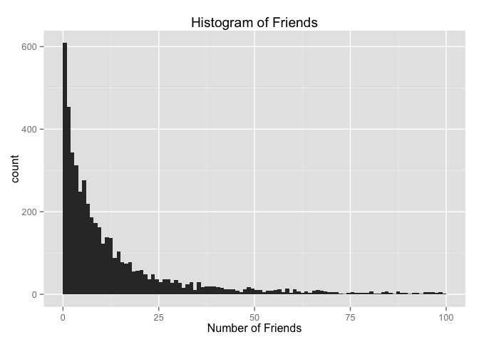
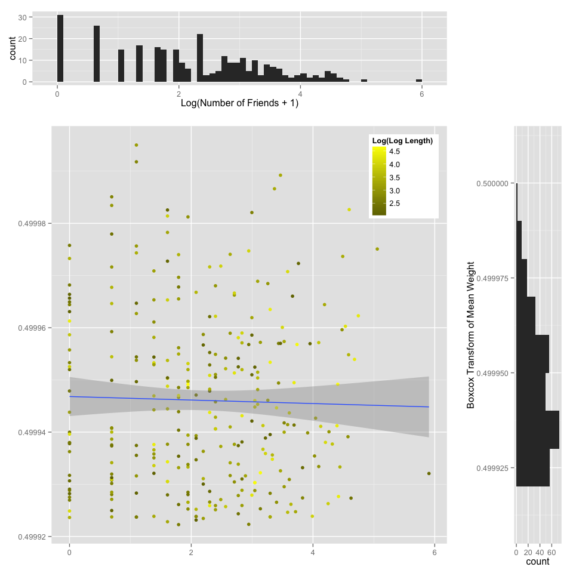
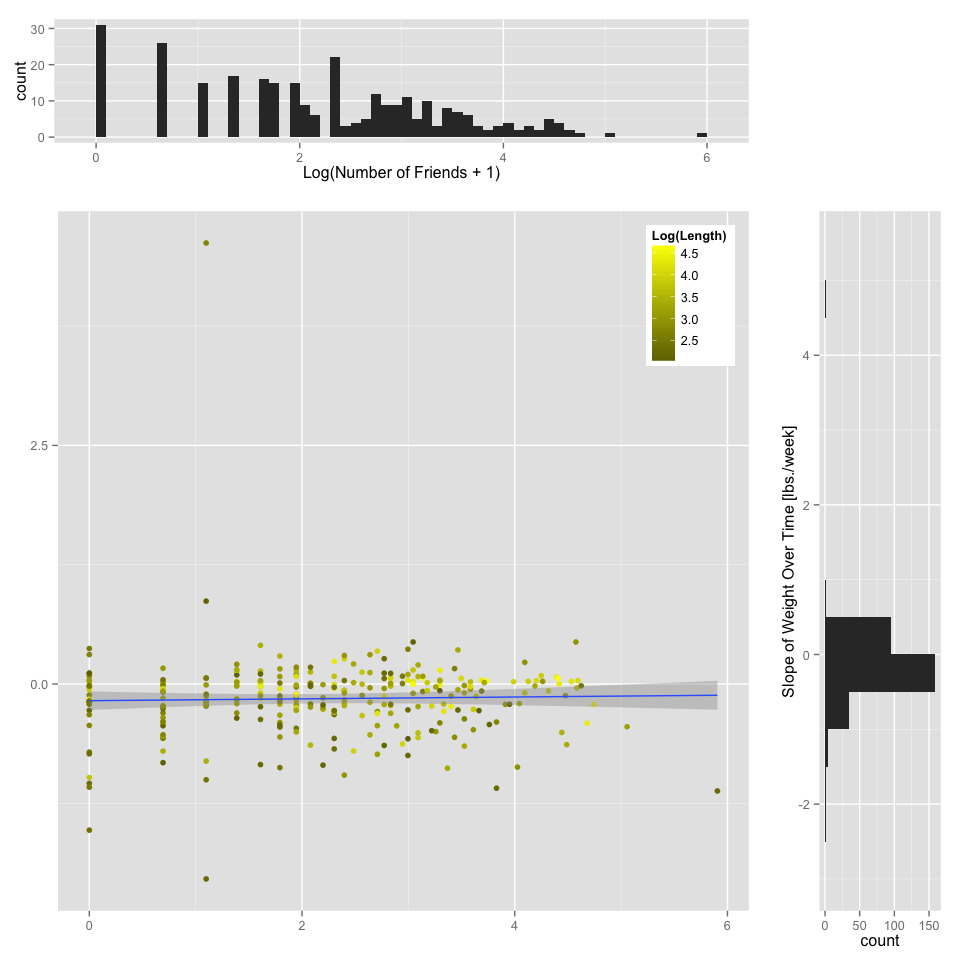
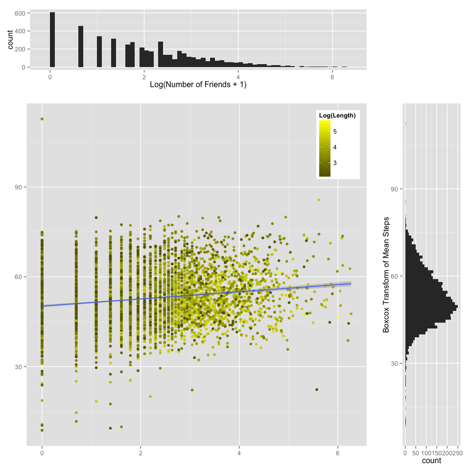
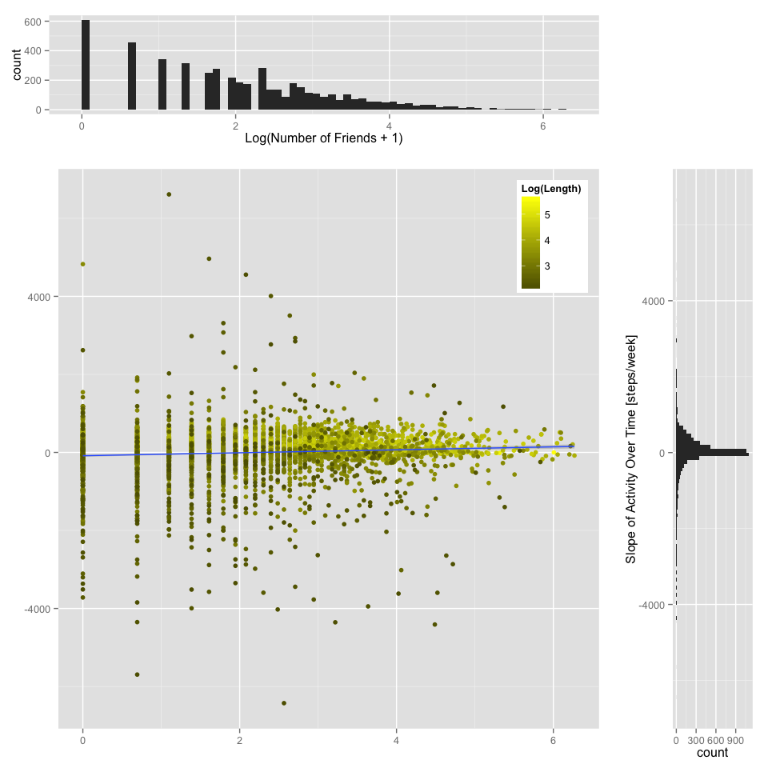

# Fitbit Friends: The social effect friends have on health
Arya Pourzanjani and Haraldur Tomas Hallgrimsson  

## Introduction
In the western world, declining activity levels are a huge cause for concern. In just six years, the adult obesity rate in the U.S. increased by more than two percent from 25.5% to 27.7% [1], corresponding to an additional five million obese adults. The rise of obesity can be put into economic terms, with an estimated total cost of $US68.8 billion in 1990 [2], when obesity rates were lower. 

A driving force behind this trend is the rise of physical inactivity in general in the U.S. [3]. On an individual level, the choice to be physically active and how much is not an isolated decision-these are decisions heavily influenced by one's social circles [4]. Having a large social network has been tied to a lower risk of dying [5], and social support has been shown to influence diet as well as exercise levels [6].

Believing that you can positively influence your own health habits and outcomes is a stumbling block for many [4] as the distance between cause and effect is very large; it can take weeks if not months between starting a new exercise regiment to actually start seeing the benefits in the mirror. We intend to study the effect of having physically active or health-conscious friends in your social network on your activity levels.

## Purpose and Goals
The purpose of this study is to utilize large health data sources to draw formal relationships between social influence and health, namely activity level and weight. Our goal is to examine the following:

* The differences in weight (both mean weight and weight change over time) between Fitbit wearers and non-Fitbit wearers
* How weight changes for Fitbit users as a function of the number of friends they have
* How activity level changes for Fitbit users as a function of the number of friends they have

## Methods
In the earlier part of this section we describe our data, including a brief snapshot of the data and how we cleaned or filtered the data for robust inference. We then follow this with an overview of our inference techniques for addressing our goals.

### Data Overview and Cleaning
Our data is separated into three categories: weight logging data, activity logging data, and friends data. In this section we describe where this data came from, what it looks like, and how we filtered or cleaned the data for robust inference. Weight logging data and the latter two types come from two different user populations. Thus not all weight loggers use Fitbit and not all Fitbit users log their weight, but some do indeed log both. 

#### Weight Loggging
Weight logging data consists of time series of weight measurements for each user. The time series are sampled irregularly because they are self-reported weights, and users choose when to upload these logs.

The validity of our inference is sensitive to certain irregularities in the time series we are using. For example, a time series with several samples in the beginning then no samples for a long time then a single sample, can give very misleading results concerning trend of the time series when doing a regression. As such, we compute a few basic features of each user's time series to ensure that we only conduct inference on valid time series. These features are the following

* Logging Length (Weeks): Length in time between first and last log. 
* Daily Upload Percentage: The percentage of days over the user's entire time logging that we have actual logs for.
* Total logs: Total number of days we have a weight log for the user.
* Max. Break Between Logs: The length of the longest period where the user did not log.
* Measurement Range Ratio: This quantity is the difference between the largest and smallest weight measurement a user recorded divided by the median of that user's measurements. It gives us a sense for time series with spurious, wild, or inaccurate measurements.

We compute them as follows (note that this portion of the code is not run live at the time of the compilation of this document due to privacy concerns): 


```r
#weight_logging_info <-  raw_weight_logs %>%
#  mutate(days_since_last_log = as.numeric(c(-1,diff(date)))) %>%
#  summarize(logging_length_weeks = as.numeric(difftime(max(date), min(date), units="weeks")),
#            log_upload_pctg = n()/(logging_length_weeks*7),
#            n_logs = n(),
#            max_logging_break = max(days_since_last_log),
#            measurement_range_ratio = diff(range(value)) / median(value)
#            ) %>%
#  filter(log_upload_pctg <= 1)
#save(weight_logging_info, file="weight_logging_info.Rdata")

load(file="weight_logging_info.Rdata")
```

The following tables gives a distributional overview of these features for our population of 15215 weightloggers.

| Variable |  Mean  |  Std. Dev.  |  2.5%  | 25% | 50% | 75% | 97.5% |
|:--------------:|:-------------:|:--------------:|:--------------:|:--------------:|:--------------:|:--------------:|:--------------:|
| Logging Length (Weeks) |30.68|31.66|0.57|4.86|19.57|50|105.09
| Daily Upload Percentage|0.23|0.24|0.01|0.06|0.14|0.32|0.94
| Total Logs |34.32|69.43|2|4|11|31|241
| Max. Break Between Logs |77.39|93.98|2|12|40|111|334
Measurement Range Ratio |1.26|9.74|0|0.04|0.52|1.14|6    |


```r
library(dplyr)
weight_logging_info_clean <- weight_logging_info %>%
  filter(logging_length_weeks >= 8) %>%
  filter(log_upload_pctg >= 0.01) %>%
  filter(n_logs >= 5) %>%
  filter(max_logging_break <= 90) %>%
  filter(measurement_range_ratio <= 0.4)
```

We filtered out users from our study based on the preceeding thresholds. This left us with a total of 1545 users. We note that when the last filter was applied (the filter for measurement ratio) the number of valid users decreased from approximately 5,000 to 1545.

#### Activity Level
We computed the same set of features for the time series of activity levels of Fitbit users. These activity levels are essentially steps per day as measured by the Fitbit device. 


```r
#fitbit_logging_info <-  raw_fitbit_logs %>%
#  mutate(days_since_last_log = as.numeric(c(-1,diff(date)))) %>%
#  summarize(logging_length_weeks = as.numeric(difftime(max(date), min(date), units="weeks")),
#            log_upload_pctg = n()/(logging_length_weeks*7),
#            n_logs = n(),
#            max_logging_break = max(days_since_last_log)
#            ) %>%
#  filter(log_upload_pctg <= 1)
#save(fitbit_logging_info, file="fitbit_logging_info.Rdata")

load(file="fitbit_logging_info.Rdata")
```

| Variable |  Mean  |  Std. Dev.  |  2.5%  | 25% | 50% | 75% | 97.5% |
|:--------------:|:-------------:|:--------------:|:--------------:|:--------------:|:--------------:|:--------------:|:--------------:|
| Logging Length (Weeks) |53.45|46.23|2|15.57|47.71|77.86|153.29
| Daily Upload Percentage|0.75|0.27|0.1|0.58|0.85|0.97|1
| Total Logs |264.41|240.41|7|60|200|411|794.9
| Max. Break Between Logs |59.71|178.01|2|4|14|57|313  |


```r
fitbit_logging_info_clean <- fitbit_logging_info %>%
  filter(logging_length_weeks >= 8) %>%
  filter(log_upload_pctg >= 0.6) %>%
  filter(n_logs >= 5) %>%
  filter(max_logging_break <= 30)
```

We place less stringent filtering constraints on the filtering of Fitbit users. This takes us from an original population of 11765 to a population of 5405.

#### Fitbit Friends
Fitbit allows its users to become friends with one another to communicate via the platform and observe each other's activity levels. We use the number of friends of each user as a quantitative measurement to guage how social a user is.


```r
load("friends_df.Rdata")
friends_df_clean <- friends_df %>%
  filter(n_friends >= 0) %>%
  filter(user_id %in% fitbit_logging_info_clean$user_id)
```

For the subset of Fitbit users we filtered for in the previous step we have the following distributional overview and histogram of friends.

| Variable |  Mean  |  Std. Dev.  |  2.5%  | 25% | 50% | 75% | 97.5% |
|:--------------:|:-------------:|:--------------:|:--------------:|:--------------:|:--------------:|:--------------:|:--------------:|
| Number of Friends |17.91|37.8|0|2|7|17|107


```r
library(ggplot2)
qplot(n_friends, data=friends_df_clean, xlab="Number of Friends", main="Histogram of Friends", binwidth=1, xlim=c(0,100))
```

 

### Models and Inference
We take a formal statistical approach to conducting inference on our data.

#### Time Series to Summary Statistics
Drawing upon the study from [7], we fit a linear regression model of user's measurements over time, then use the estimated coefficients from these models as summary statistics for each user. This amounts to a mean term and a trend term for each time series of each user.

#### Regression Models and Statistical Tests
To assess the differences in weight and weight change over time between Fitbit users and non-Fitbit users, we use the non-parametric Wilcoxon test to check for differences in estimated mean and slope terms between the two respective populations.

To asses the relationship that weight and activity levels have with the number of friends a person has, we fit ordinary linear regression models and conduct standard tests for significance. For these regression models we apply BoxCox transformations to our data where appropriate to control for heterscedasity and guard against spurious results. We also utilize how long a user has been logging in our regression models to control for that possible confounder.

## Results
In this section we provide results that answer our proposed goals.

### Fitbit Effect on Weight

```r
#weight_slope <- raw_weight_logs %>%
#  filter(user_id %in% weight_logging_info_clean$user_id) %>%
#  group_by(user_id) %>%
#  mutate(weeks_since_first_log=as.numeric(date-min(date)) / (60*60*24*7)) %>%
#  do(model=lm(value~weeks_since_first_log, data=.)) %>%
#  mutate(slope = summary(model)$coeff[2]) %>%
#  select(-model)

#weight_mean <- raw_weight_logs %>%
#  filter(user_id %in% weight_logging_info_clean$user_id) %>%
#  group_by(user_id) %>%
#  summarize(mean_weight=mean(value)) %>%
#  select(user_id, mean_weight)

#weight_summary <- inner_join(weight_slope, weight_mean)
#save(weight_summary, file="weight_summary.Rdata")

load(file="weight_summary.Rdata")

fitbit_effect <- weight_summary %>%
  mutate(uses_fitbit=user_id %in% fitbit_logging_info_clean$user_id)
```


```r
ggplot() + geom_density(aes(mean_weight, color=uses_fitbit),data=fitbit_effect)
```

 


```r
fitbit_users <- fitbit_effect %>% filter(uses_fitbit==TRUE)
nonfitbit_users <- fitbit_effect %>% filter(uses_fitbit==FALSE)
wilcox.test(fitbit_users$mean_weight, nonfitbit_users$mean_weight)
```

```
## 
## 	Wilcoxon rank sum test with continuity correction
## 
## data:  fitbit_users$mean_weight and nonfitbit_users$mean_weight
## W = 158237, p-value = 4.927e-11
## alternative hypothesis: true location shift is not equal to 0
```

Non-Fitbit users have a much larger tail in their distribution of mean weight. The Wilcoxon test confirms this difference in weight distribution between the two populations.


```r
ggplot() + geom_density(aes(slope, color=uses_fitbit), data=fitbit_effect)
```

 


```r
wilcox.test(fitbit_users$slope, nonfitbit_users$slope)
```

```
## 
## 	Wilcoxon rank sum test with continuity correction
## 
## data:  fitbit_users$slope and nonfitbit_users$slope
## W = 212126.5, p-value = 0.4117
## alternative hypothesis: true location shift is not equal to 0
```

The slope distribution of weight appears more similar for the two groups. Here we fail to reject the hypothesis that the data from the two groups comes from the same distribution.

### Relationship Between Weight and Number of Fitbit Friends

```r
weight_summary_friends <- inner_join(weight_summary, friends_df_clean)
weight_summary_friends_length <- inner_join(weight_summary_friends, weight_logging_info_clean)
```


```r
library(MASS)
boxcox(mean_weight~log(n_friends+1)+log(logging_length_weeks), data=weight_summary_friends_length)
```

 

```r
mean_weight_boxcox <- (weight_summary_friends_length$mean_weight^-2 - 1) / -2
```


```r
source("scatter_marg.R")
scatter_marg(log(weight_summary_friends_length$n_friends+1), mean_weight_boxcox, log(weight_summary_friends_length$logging_length_weeks), "Log(Number of Friends + 1)", "Boxcox Transform of Mean Weight", "Log(Log Length)", 0.1, 0.00001)
```

```
## Warning: position_stack requires constant width: output may be incorrect
```

 


```r
summary(lm(mean_weight_boxcox~log(n_friends+1)+log(logging_length_weeks), data=weight_summary_friends_length))
```

```
## 
## Call:
## lm(formula = mean_weight_boxcox ~ log(n_friends + 1) + log(logging_length_weeks), 
##     data = weight_summary_friends_length)
## 
## Residuals:
##        Min         1Q     Median         3Q        Max 
## -2.405e-05 -1.407e-05 -2.641e-06  1.133e-05  4.839e-05 
## 
## Coefficients:
##                             Estimate Std. Error    t value Pr(>|t|)    
## (Intercept)                4.999e-01  4.654e-06 107425.551   <2e-16 ***
## log(n_friends + 1)        -5.435e-07  7.820e-07     -0.695    0.488    
## log(logging_length_weeks)  1.483e-06  1.488e-06      0.997    0.320    
## ---
## Signif. codes:  0 '***' 0.001 '**' 0.01 '*' 0.05 '.' 0.1 ' ' 1
## 
## Residual standard error: 1.654e-05 on 294 degrees of freedom
## Multiple R-squared:  0.004038,	Adjusted R-squared:  -0.002737 
## F-statistic: 0.596 on 2 and 294 DF,  p-value: 0.5517
```

The scatterplot and regression model indicate no significant relationship between weight and the number of friends one has.


```r
scatter_marg(log(weight_summary_friends_length$n_friends+1), weight_summary_friends_length$slope, log(weight_summary_friends_length$logging_length_weeks), "Log(Number of Friends + 1)", "Slope of Weight Over Time [lbs./week]", "Log(Length)", 0.1, 0.5)
```

 


```r
summary(lm(slope~log(n_friends+1)+log(logging_length_weeks), data=weight_summary_friends_length))
```

```
## 
## Call:
## lm(formula = slope ~ log(n_friends + 1) + log(logging_length_weeks), 
##     data = weight_summary_friends_length)
## 
## Residuals:
##     Min      1Q  Median      3Q     Max 
## -1.7949 -0.1438  0.0343  0.1659  4.8148 
## 
## Coefficients:
##                            Estimate Std. Error t value Pr(>|t|)    
## (Intercept)               -0.484760   0.119348  -4.062 6.25e-05 ***
## log(n_friends + 1)        -0.005566   0.020054  -0.278   0.7815    
## log(logging_length_weeks)  0.108703   0.038162   2.848   0.0047 ** 
## ---
## Signif. codes:  0 '***' 0.001 '**' 0.01 '*' 0.05 '.' 0.1 ' ' 1
## 
## Residual standard error: 0.4243 on 294 degrees of freedom
## Multiple R-squared:  0.02766,	Adjusted R-squared:  0.02104 
## F-statistic: 4.182 on 2 and 294 DF,  p-value: 0.01619
```

We also see no relationship between the trend in weight and number of friends. There is however a highly significant relationship between the trend in weight and the length of time the user has been tracking their weight.

### Relationship Between Activity Level and Number of Fitbit Friends

```r
#activity_slope <- raw_fitbit_logs %>%
# filter(user_id %in% fitbit_logging_info_clean$user_id) %>%
#  group_by(user_id) %>%
#  mutate(weeks_since_first_log=as.numeric(date-min(date)) / (60*60*24*7)) %>%
#  do(model=lm(value~weeks_since_first_log, data=.)) %>%
#  mutate(slope = summary(model)$coeff[2]) %>%
#  select(-model)

#activity_mean <- raw_fitbit_logs %>%
#  filter(user_id %in% fitbit_logging_info_clean$user_id) %>%
#  group_by(user_id) %>%
#  summarize(mean_steps=mean(value)) %>%
#  select(user_id, mean_steps)

#activity_summary <- inner_join(activity_slope, activity_mean)
#save(activity_summary, file="activity_summary.Rdata")

load(file="activity_summary.Rdata")
activity_summary_friends <- inner_join(activity_summary, friends_df_clean)
activity_summary_friends_length <- inner_join(activity_summary_friends, fitbit_logging_info_clean)
```


```r
boxcox(mean_steps~log(n_friends+1)+log(logging_length_weeks), data=activity_summary_friends_length)
```

 

```r
mean_steps_boxcox <- (activity_summary_friends_length$mean_steps^0.3 - 1) / 0.3
```


```r
scatter_marg(log(activity_summary_friends_length$n_friends+1), mean_steps_boxcox, log(activity_summary_friends_length$logging_length_weeks), "Log(Number of Friends + 1)", "Boxcox Transform of Mean Steps", "Log(Length)", 0.1, 1)
```

 


```r
summary(lm(mean_steps_boxcox~log(n_friends+1)+log(logging_length_weeks), data=activity_summary_friends_length))
```

```
## 
## Call:
## lm(formula = mean_steps_boxcox ~ log(n_friends + 1) + log(logging_length_weeks), 
##     data = activity_summary_friends_length)
## 
## Residuals:
##     Min      1Q  Median      3Q     Max 
## -45.474  -5.918  -0.670   5.855  62.150 
## 
## Coefficients:
##                           Estimate Std. Error t value Pr(>|t|)    
## (Intercept)               58.01945    0.63960   90.71   <2e-16 ***
## log(n_friends + 1)         1.46445    0.09837   14.89   <2e-16 ***
## log(logging_length_weeks) -2.21021    0.16849  -13.12   <2e-16 ***
## ---
## Signif. codes:  0 '***' 0.001 '**' 0.01 '*' 0.05 '.' 0.1 ' ' 1
## 
## Residual standard error: 8.825 on 5061 degrees of freedom
## Multiple R-squared:  0.06052,	Adjusted R-squared:  0.06015 
## F-statistic:   163 on 2 and 5061 DF,  p-value: < 2.2e-16
```

As shown in our scatterplot, there exists a highly significant relationship between the mean steps a user takes and the number of friends that user has, even when controling for the length of time a user has spent logging.


```r
scatter_marg(log(activity_summary_friends_length$n_friends+1), activity_summary_friends_length$slope, log(activity_summary_friends_length$logging_length_weeks), "Log(Number of Friends + 1)", "Slope of Activity Over Time [steps/week]", "Log(Length)", 0.1, 100)
```

 


```r
summary(lm(slope~log(n_friends+1)+log(logging_length_weeks), data=activity_summary_friends_length))
```

```
## 
## Call:
## lm(formula = slope ~ log(n_friends + 1) + log(logging_length_weeks), 
##     data = activity_summary_friends_length)
## 
## Residuals:
##     Min      1Q  Median      3Q     Max 
## -6012.2  -164.3   -21.4   177.1  7014.6 
## 
## Coefficients:
##                           Estimate Std. Error t value Pr(>|t|)    
## (Intercept)               -946.046     38.942 -24.294   <2e-16 ***
## log(n_friends + 1)           7.989      5.989   1.334    0.182    
## log(logging_length_weeks)  243.805     10.258  23.767   <2e-16 ***
## ---
## Signif. codes:  0 '***' 0.001 '**' 0.01 '*' 0.05 '.' 0.1 ' ' 1
## 
## Residual standard error: 537.3 on 5061 degrees of freedom
## Multiple R-squared:  0.1071,	Adjusted R-squared:  0.1067 
## F-statistic: 303.4 on 2 and 5061 DF,  p-value: < 2.2e-16
```

We fail to see a significant relationship between the slope in one's activity levels and the number of friends they have.

## Discussion
We showed in this study that there exists a significant difference in the distribution of weights of Fitbit users and non-Fitbit users. In particular, there are many heavy non-Fitbit users. On the other hand, we did not see a difference in weight trends between these two groups of users. One flaw in this trend factor however is that we assumed that users started logging their weight and tracking their Fitbit steps around the same time and had both kinds of measurements recently in time. This possible confounder could be a source for the lack of a discernbile difference that we would expect to see.

We also showed that there were no differences in weight or differences in weight trends for Fitbit users with differing number of friends.

Lastly, we showed that activity level changes as a function of the number of Fitbit friends one has, but trends in activity level does not. The former is sociologically significant and is cause for further research. The trend has the problem that number of friends were only available at the time of study and not throughout time, thus we make the assumption of a static friend network during a user's entire weight trajectory.

## References
[1] Justin McCarthy. In U.S., adult obesity rate now at 27.7%, May 2014. [Online; posted 22-May-2014].
[2]  Anne M Wolf and Graham A Colditz. The cost of obesity.Pharmacoeconomics, 5(1):34-37, 1994.
[3]  Ross C Brownson, Tegan K Boehmer, and Douglas A Luke. Declining rates of physical activity in the United States: what are the contributors? Annu. Rev. Public Health, 26:421-443, 2005
[4] Albert Bandura. Health promotion by social cognitive means. Health education & behavior, 31(2):143-164, 2004.
[5]  Kristina Orth-Gomer and Jeれy V Johnson. Social network interaction and mortality: a six year follow-up study of a random sample of the swedish population. Journal of chronic diseases, 40(10):949-957, 1987.
[6]  James F Sallis, Robin M Grossman, Robin B Pinski, Thomas L Patterson, and Philip R Nader. The development of scales to measure social support for diet and exercise behaviors. Preventive medicine, 16(6):825-836, 1987.
[7] Kevin Lewis, Marco Gonzalez, and Jason Kaufman. Social selection and peer in uence in an online social network. Proceedings of the National Academy of Sciences, 109(1):68-72, 2012
